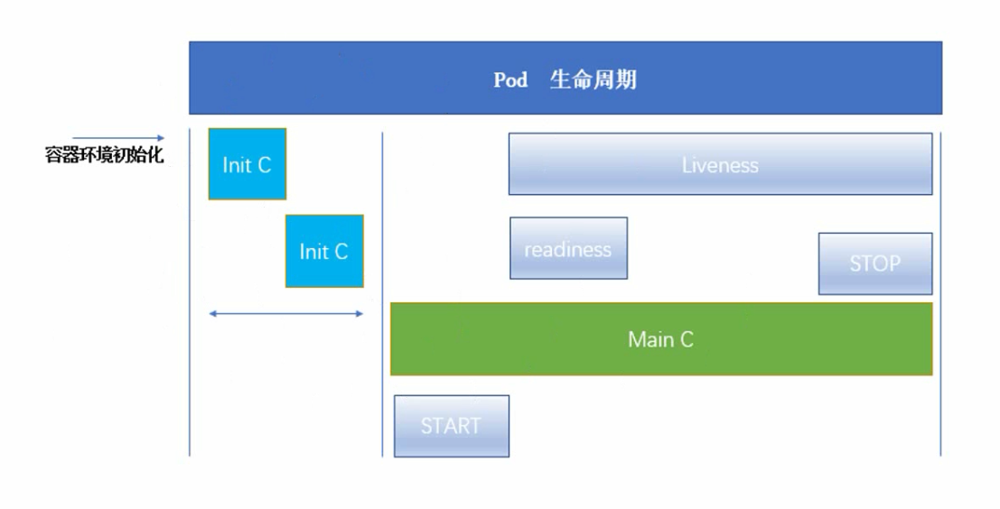

## 一、K8S中的资源

K8s  中所有的内容都抽象为资源， 资源实例化之后，叫做对象

### 名称空间级别

eg : kube-system 只在这个名称空间下可用。

1、工作负载型资源 ( workload ) ： Pod 、 ReplicaSet 、 Deployment 、 StatefulSet 、 DaemonSet 、 Job 、
CronJob  (  ReplicationController 在 v1.11  版本被废弃 ) 

2、服务发现及负载均衡型资源 (  ServiceDiscovery LoadBalance  ): Service 、 Ingress 、.....

3、配置与存储型资源： Volume(  存储卷  )、 CSI(  容器存储接口, , 可以扩展各种各样的第三方存储卷 ) 

4、特殊类型的存储卷： ConfigMap (  当配置中心来使用的资源类型 )  、 Secret( 保存敏感数据) ) 、
DownwardAPI(把外部环境中的信息输出给容器) 

### 集群级别

不管在什么名称空间下定义，在其它名称空间下都可用

集群级资源： Namespace 、 Node 、 Role 、 ClusterRole 、 RoleBinding 、ClusterRoleBinding

### 元数据型

给我们提供一个指标，不像名称空间也不像集群级别的，归属在这两者之间。

元数据型资源： HPA 、 PodTemplate 、LimitRange

## 二、资源清单

在 k8s  中，一般使用 yaml 格式的文件来创建符合我们预期期望的 pod  ，这样的 yaml 文件我们一般
称为资源清单。

[点击Yaml语法pdf](files/Yaml语法.pdf)

[点击资源清单](files/Kubernetes资源清单.pdf)

## 三、常用字段解释说明

| 参数名                                      | 字段类型 | 说明                                                         |
| ------------------------------------------- | -------- | ------------------------------------------------------------ |
| version                                     | String   | 这里指的是K8S API的版本，目前基本上是v1,可以用kubectl api-versions命令查询 |
| kind                                        | String   | 这里指的是yaml文件定义的资源类型和角色，比如：Pod            |
| metadata                                    | Object   | 元数据对象，固定值就写metadata                               |
| metadata.name                               | String   | 元数据对象的名字，这里由我们编写，比如命名Pod的名字          |
| metadata.namespace                          | String   | 元数据对象的命名空间，由我们自身定义                         |
| Spec                                        | Object   | 详细定义对象，固定值就写Spec                                 |
| spec.containers[]                           | List     | 这里是Spec对象的容器列表定义，是个列表                       |
| spec.containers[].name                      | String   | 这里是定义容器的名字                                         |
| spec.containers[].image                     | String   | 这里定义要用到的镜像名称                                     |
| --以上参数足存运行一个Pod了--               | -------- | --------------                                               |
| spec.containers[].imagePullPolicy           | String   | 定义镜像拉取策略，有Always、Never、IfNotPresent三个值可选  Always:意思是每次都尝试重新拉取镜像  Never:表示仅使用本地镜像  IfNotPresent:如果本地有镜像就使用本地镜像，没有就拉取在线镜像。默认是Always |
| spec.containers[].command[]                 | List     | 指定容器启动命令，因为是数组可以指定多个，不指定则使用镜像打包时使用的启动命令。 |
| spec.containers[].args[]                    | List     | 指定容器启动命令参数，因为是数组可以指定多个。               |
| spec.containers[].workingDir                | String   | 指定容器的工作目录。                                         |
| spec.containers[].volumeMounts[]            | List     | 指定容器内部的存储卷配置。                                   |
| spec.containers[].volumeMounts[].name       | String   | 指定可以被容器挂载的存储卷的名称。                           |
| spec.containers[].volumeMounts[].mountPath  | String   | 指定可以被容器挂载的存储卷的路径。                           |
| spec.containers[].volumeMounts[].readOnly   | String   | 设置存储卷路径的读写模式，true或者false,默认true             |
| spec.containers[].ports[]                   | List     | 指定容器需要用到的端口列表                                   |
| spec.containers[].ports[].name              | String   | 指定端口名称                                                 |
| spec.containers[].ports[].containerPort     | String   | 指定容器需要监听的端口号                                     |
| spec.containers[].ports[].hostPort          | String   | 指定容器所在主机需要监听的端口号，默认跟上面containerPort相同，注意设置了hostPort同一台主机无法启动该容器的相同副本（因为主机的端口号不能相同，这样会冲突） |
| spec.containers[].ports[].protocol          | String   | 指定端口协议，支持TCP和UDP，默认值为TCP                      |
| spec.containers[].env[]                     | List     | 指定容器运行前需设置的环境变量列表                           |
| spec.containers[].env[].name                | String   | 指定环境变量名称                                             |
| spec.containers[].env[].value               | String   | 指定环境变量值                                               |
| spec.containers[].resources                 | Object   | 指定资源限制和资源请求的值（这里开始就是设置容器的资源上限） |
| spec.containers[].resources.limits          | Object   | 指定设置容器运行时资源的运行上限                             |
| spec.containers[].resources.limits.cpu      | String   | 指定CPU的限制，单位为core数，将用于docker run --cpu-share参数（这里前面文章Pod资源限制有讲过） |
| spec.containers[].resources.limits.memory   | String   | 指定MEM内存的限制，单位为MIB、GIB                            |
| spec.containers[].resources.requests        | Object   | 指定容器启动和调度时的限制设置                               |
| spec.containers[].resources.requests.cpu    | String   | CPU请求，单位为core数，容器启动时初始化可用数量              |
| spec.containers[].resources.requests.memory | String   | 内存请求，单位为MIB、GIB，容器启动时初始化可用数量           |
| spec.restartPolicy                          | String   | 定义Pod的重启策略，可选值为Always、OnFailure，默认值为Always. Always：Pod一旦终止运行，则无论容器是如何终止的，kubelet服务都将重启它。 OnFailure：只有Pod以非零退出码终止时，kubelet才会重启该容器。如果容器正常结束（退出码为0），则kubelet将不会重启它。Never：Pod终止后，kubelet将退出码报告给Master,不会重启该Pod |
| spec.nodeSelector                           | Object   | 定义Node的Label过滤标签，以key:value格式指定                 |
| spec.imagePullSecrets                       | Object   | 定义pull镜像时使用secret名称，以name:secretkey格式指定       |
| spec.hostNetwork                            | Boolean  | 定义是否使用主机网络模式，默认值为false，设置true表示使用宿主机网络，不使用docker网桥，同时设置了true将无法在同一台宿主机上启动第二个副本。 |

```shell
#查看Pod的模板
kubectl expalin pod
#查看模版中某一项 比如：查看apiVersion
kubectl expalin pod.apiVersion
```

一个简单的Pod模板

```yaml
apiVersion: v1
kind: pod
metadata:
  name: myapp-pod
  labels:
    app: myapp
    version: v1
spec:
  containers:
  - name: app
    image: bingju328/library/myapp:v1
  - name: test
    image: bingju328/library/myapptest:v1
  #如果一个Pod里面运行多个镜像时 需要指定端口号，否则都用默认端口号  会重复
  #InitContainers: 多个可以用同一个端口号，因为InitC 是串行执行的，第一个退出才执行第二个。
```


## 四、容器生命周期

### Pod生命周期




kubectl 向kube api 发送指命   ->    kube api 从etcd中存取信息 跟据信息调度kubelet   ->  kubelet操作对应的CRI (container runtime Interface) CRI去完成容器的初始化

CRI初始化：

CRI先启动一个Pause的基础容器（负责网络及存储卷共享）   ->   Init Container (初始化容器 零个、一个或多个)  ->  main Container 进入主容器 -> main Conatiner 刚运行时 可以允许它启动一条命令或脚本 （START）-> main Container 启动 启动中 会有readiness 和 Liveness 的参于 -> 启动完成后 可以运行 命令或脚本 (STOP) 

readiness : 检测主容器是否启动成功，成功后变为Running的状态

Liveness: 伴随整个Main Container 的启动运行周期，发现主容器异常、失败等，控制 主容器重启国。

Init C(初始化容器) ：比如容器启动需要依赖某些环境，Init C 就可以构建容器所需要的环境，Init C 只是用来初始化的，并不会跟随Pod的整个生命周期，也就是说在初始化完成时就会死亡。init C 不能并行


Pod    能够具有多个容器，应用运行在容器里面，但是它也可能有一个或多个先于应用容器启动的 Init
容器

Init  容器与普通的容器非常像，除了如下两点：

- Init  容器总是运行到成功完成为止
- 每个 Init  容器都必须在下一个 Init  容器启动之前成功完成

如果 Pod  的 Init  容器失败， Kubernetes  会不断地重启该 Pod ，直到 Init  容器成功为止。然而，
如果 Pod  对应的 restartPolicy  为 Never，它不会重新启动

因为 Init  容器具有与应用程序容器分离的单独镜像，所以它们的启动相关代码具有如下优势：

- 它们可以包含并运行实用工具，但是出于安全考虑，是不建议在应用程序容器镜像中包含这些实用的工具。这些工具放在InitC中

- 它们可以包含使用工具和定制化代码来安装，但是不能出现在应用程序镜像中。例如，创建镜像没必要 FROM  另一个镜像，只需要在安装过程中使用类似 sed 、 awk 、 python  或 dig这样的工具。 同上一条。

- 应用程序镜像可以分离出创建和部署的角色，而没有必要联合它们构建一个单独的镜像。

  比如：用InitC 构建代码  MainC 部署运行代码。

- Init  容器使用 Linux Namespace ，所以相对应用程序容器来说具有不同的文件系统视图。因
  此，它们能够具有访问 Secret  的权限，而应用程序容器则不能。

  比如：Main C需要某个文件夹的一个文件，为了安全，可以让Init C 去获取Main C需要的文件 

- 它们必须在应用程序容器启动之前运行完成，而应用程序容器是并行运行的，所以 Init  容
  器能够提供了一种简单的阻塞或延迟应用容器的启动的方法，直到满足了一组先决条件。

  比如：有两个Main C 一个是 mysql 一个是 jar应用 对应的有两组 InitC 。如果jar没有InitC , 可能会出现jar先启动成功了，但连不上mysql , 然后liveness以为Pod异常重启整个Pod，就这样无限重启。这个时候就需要在jar中加一个InitC ,用来检测Mysql是否启动成功，成功则退出自已的容器，jar开始启动，没成功则一直阻塞。

### 使用Init案例

[点击使用Init案例](files/Kubernetespod探测.pdf)

**特殊说明**

- 在 Pod  启动过程中， Init  容器会按顺序在网络和数据卷初始化 (pause 容器) 之后启动。每个容器必须在下一个容器启动之前成功退出.

  **pause 容器: 网络和数据卷初始化的 我们不能操作。**

- 如果由于运行时或失败退出，将导致容器启动失败，它会根据 Pod  的 restartPolicy  指定的策略进行重试。然而，如果 Pod  的 restartPolicy  设置为 Always ， Init  容器失败时会使用RestartPolicy  策略

- 在所有的 Init  容器没有成功之前， Pod  将不会变成 Ready  状态。 Init  容器的端口将不会在Service  中进行聚集。 正在初始化中的 Pod  处于 Pending  状态，但应该会将 Initializing  状态设置为 true

- 如果   Pod  重启，所有 Init  容器必须重新执行

-   对 Init  容器 spec  的修改被限制在容器 image  字段，修改其他字段都不会生效。更改 Init容器的 image  字段，等价于重启该 Pod

- Init  容器具有应用容器的所有字段。除了 readinessProbe ，因为 Init  容器无法定义不同于完成（ completion ）的就绪（ readiness ）之外的其他状态。这会在验证过程中强制执行

- 在 Pod  中的每个 app  和 Init  容器的名称必须唯一；与任何其它容器共享同一个名称，会在验证时抛出错误

### 容器探针

探针是由    kubelet    对容器执行的定期诊断。要执行诊断， kubelet  调用由容器实现的    Handler 。有三种类型的处理程序：

- ExecAction ：在容器内执行指定命令。如果命令退出时返回码为 0  则认为诊断成功
- TCPSocketAction ：对指定端口上的容器的 IP  地址进行 TCP  检查。如果端口打开，则诊断被认为是成功的。
- HTTPGetAction ：对指定的端口和路径上的容器的 IP  地址执行 HTTP Get  请求。如果响应的状态码大于等于 200  且小于 400, 则诊断被认为是成功的

每次探测都将获得以下三种结果之一：

- 成功：容器通过了诊断。
- 失败：容器未通过诊断。
- 未知：诊断失败，因此不会采取任何行动

### 探测方式

livenessProbe ：指示容器是否正在运行。如果存活探测失败，则 kubelet  会杀死容器，并且容器将受到其 重启策略 的影响。如果容器不提供存活探针，则默认状态为 Success

readinessProbe ：指示容器是否准备好服务请求。如果就绪探测失败，端点控制器将从与 Pod  匹配的所有 Service  的端点中删除该 Pod  的 IP  地址。初始延迟之前的就绪状态默认为 Failure 。如果容器不提供就绪探针，则默认状态为 Success

[点击打开示例](files/Kubernetespod探测.pdf)

### Pod hook

Pod hook （钩子）是由 Kubernetes  管理的 kubelet  发起的，当容器中的进程启动前或者容器中的进
程终止之前运行，这是包含在容器的生命周期之中。可以同时为 Pod  中的所有容器都配置 hook

Hook  的类型包括两种：

- exec ：执行一段命令
-   HTTP ：发送 HTTP 请求

### 重启策略

PodSpec  中有一个 restartPolicy  字段，可能的值为 Always 、 OnFailure  和 Never 。默认为Always 。 restartPolicy  适用于 Pod  中的所有容器。 restartPolicy  仅指通过同一节点上的 kubelet  重新启动容器。失败的容器由 kubelet  以五分钟为上限的指数退避延迟（ 10 秒， 20 秒， 40秒 ... ）重新启动，并在成功执行十分钟后重置。如 Pod  文档 中所述，一旦绑定到一个节点， Pod  将永远不会重新绑定到另一个节点。

### 状态示例

[点击打开状态示例](files/Kubernetes状态示例.pdf)

### Pod phase

Pod  的 status  字段是一个 PodStatus 对象， PodStatus 中有一个 phase  字段。

Pod  的相位（ phase ）是 Pod  在其生命周期中的简单宏观概述。该阶段并不是对容器或 Pod  的综合汇总，也不是为了做为综合状态机

Pod  相位的数量和含义是严格指定的。除了本文档中列举的状态外，不应该再假定 Pod  有其他的
phase 值。可能存在的值 ：

- 挂起（ Pending ）： Pod  已被 Kubernetes  系统接受，但有一个或者多个容器镜像尚未创建。等待时间包括调度 Pod 的时间和通过网络下载镜像的时间，这可能需要花点时间
- 运行中（ Running ）：该 Pod  已经绑定到了一个节点上， Pod  中所有的容器都已被创建。至少有一个容器正在运行，或者正处于启动或重启状态
- 成功（ Succeeded ）： Pod  中的所有容器都被成功终止，并且不会再重启
- 失败（ Failed ）： Pod  中的所有容器都已终止了，并且至少有一个容器是因为失败终止。也就是说，容
  器以非 0 状态退出或者被系统终止
- 未知（ Unknown ）：因为某些原因无法取得 Pod  的状态，通常是因为与 Pod  所在主机通信失败

